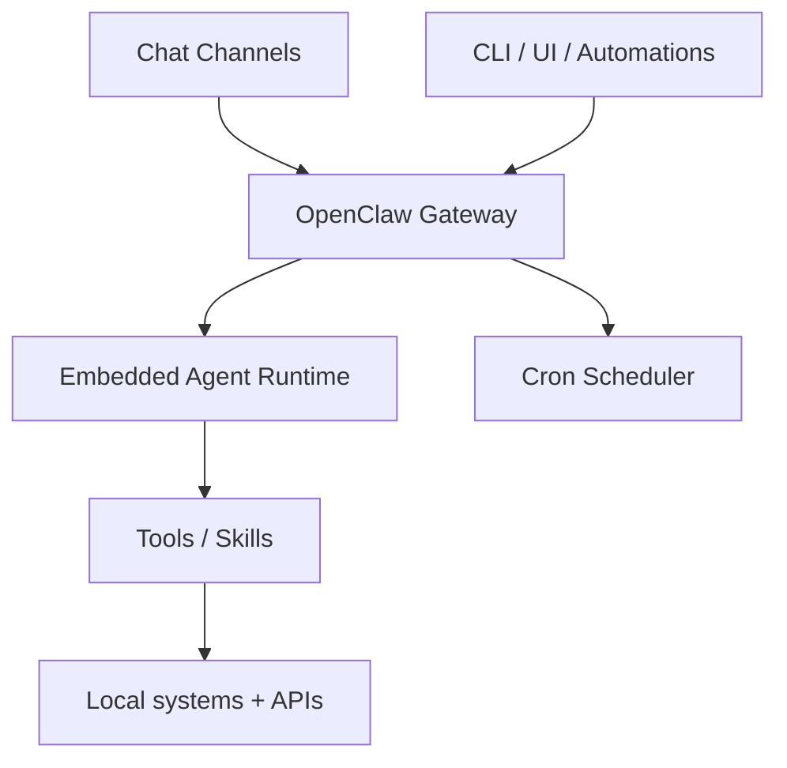

# OpenClaw + Pi “Primitive Harness” + Local‑Only LLM Hardware Research

## Executive Summary
OpenClaw is an open‑source personal AI assistant centered on a single always‑on Gateway that owns messaging channels and exposes control‑plane APIs; its docs state that the embedded agent runtime is built on the **Pi agent core**, tying OpenClaw directly to the Pi “primitive harness” lineage.[^1][^2][^3] Pi itself is positioned as a minimal terminal coding harness focused on primitives (extensions, skills, prompt templates), and it is implemented as a monorepo with a dedicated agent core (`pi-agent-core`) and unified LLM API (`pi-ai`).[^4][^5] For local‑only models, VRAM is the dominant constraint: fp16/bf16 weight memory is ~2× model parameters in GB, and quantization reduces VRAM at measurable accuracy cost (documented by GPTQ, llama.cpp, and AWQ PPL/accuracy tables).[^6][^7][^8][^9][^10] When VRAM is insufficient, frameworks offload to CPU RAM (and sometimes disk), introducing overhead; fast PCIe/NVLink, ample RAM, and NVMe storage reduce these bottlenecks.[^11][^12][^13]

## Scope and Assumptions
- **Scope:** What OpenClaw is, how it works, what it is based on, how it relates to the Pi “AI primitive harness,” and local‑only model hardware sizing including quantization, VRAM, and CPU offload.
- **Assumption:** You plan to run **local inference only**, so model access should go through local servers or OpenAI‑compatible local endpoints; OpenClaw’s Gateway exposes OpenAI‑compatible endpoints.[^14]

## OpenClaw: What It Is and How It Works
**Definition & positioning.** OpenClaw is described as a personal AI assistant that runs on your devices and responds across channels you already use, with the Gateway acting as the control plane; the project was “built for Molty, a space lobster AI assistant,” which is its stated origin.[^1]

**Architecture summary.**
- **Gateway:** A single long‑lived Gateway owns messaging surfaces and exposes a typed WebSocket protocol to clients and nodes, acting as the control plane.[^2] It also serves HTTP APIs including OpenAI‑compatible endpoints.[^14]
- **Agent runtime:** OpenClaw runs a single embedded agent runtime per Gateway with workspace/boot files, and the docs explicitly state this embedded runtime is built on the **Pi agent core**.[^3]
- **Channels:** Messaging channels are connected via the Gateway; channel plugins are ordered and exposed through a runtime registry.[^15][^16]
- **Tools:** Tools are the mechanism for any action beyond text generation.[^17]
- **Cron schedules:** Cron is the Gateway’s built‑in scheduler and persists jobs; schedules can announce results to channels or webhooks.[^18]

**Mermaid overview (control/data flow).**

The Gateway owns channels and routes messages to the embedded agent runtime; tools execute actions, and cron schedules inject tasks on a schedule.[^2][^3][^17][^18]

**Implementation evidence (repo‑level).**
- OpenClaw is a pnpm monorepo with `packages/*` and `extensions/*`, reflecting a modular runtime + plugin structure.[^19]
- Gateway boot logic loads per‑workspace `BOOT.md` instructions and restores session mappings to avoid corrupting state during boot checks.[^20]
- Embedded agent runs are tracked via a global singleton state in the `pi-embedded-runner`, showing an internal agent‑runtime orchestration layer.[^21]

## How OpenClaw Relates to the Pi “Primitive Harness”
**Pi is a minimal harness.** Pi is described as a minimal terminal coding harness with a “Primitives, not features” philosophy, emphasizing extensibility via extensions, skills, prompt templates, and themes.[^4]

**Pi’s implementation components.**
- `pi-agent-core`: a stateful agent loop with tool execution and event streaming, built on `pi-ai`.[^5][^22]
- `pi-ai`: a unified LLM API/registry with streaming and provider abstractions, which `pi-agent-core` uses for inference.[^23][^24]

**Explicit linkage.** OpenClaw’s agent runtime docs state it is built on the **Pi agent core**.[^3] Pi’s docs list OpenClaw as a real‑world SDK integration example, reinforcing the relationship.[^4][^25]

## Local‑Only Model Hardware: Core Concepts

### 1) Parameters → VRAM (weight memory)
Rule‑of‑thumb for weight memory in VRAM:
- **fp32:** VRAM ≈ **4 × X GB** for X‑billion parameters.
- **bf16/fp16:** VRAM ≈ **2 × X GB** for X‑billion parameters.
For short contexts (<1024 tokens), inference memory is dominated by weight storage.[^6]

### 2) Quantization: VRAM savings and format overhead
**Base bytes per parameter** (weight memory): FP16 = 2 bytes, INT8 = 1 byte, INT4 = 0.5 bytes.[^26]  
**Format overhead multipliers**: GGUF ≈ 1.15×, GPTQ ≈ 1.10×, AWQ ≈ 1.08× over raw weight bytes.[^26]  
**GGUF effective bits/param** vary by quant type (e.g., Q4_0 ≈ 4.5 bits, Q4_K ≈ 5.5 bits, Q5_K ≈ 6.5 bits, Q8_0 ≈ 8 bits), which should be converted to bytes/param before applying overhead.[^26]

### 3) Quantization quality trade‑offs (PPL/accuracy)
Quantization reduces VRAM but can degrade quality, with concrete metrics in the literature:
- **GPTQ (LLaMA WikiText‑2 PPL):** FP16 7B PPL 5.68 vs 4‑bit GPTQ 6.09; 3‑bit GPTQ 8.07 (larger degradation at lower bits).[^8]
- **llama.cpp GGUF PPL scoreboard:** LLaMA‑3 8B f16 PPL 6.233 vs q8_0 6.234 vs q6_K 6.253 vs q4_0 6.700, showing measurable PPL drift as bits drop.[^9]
- **AWQ VILA‑1.5 (VQA accuracy):** Example deltas show small drops from FP16 to AWQ‑INT4 (e.g., VQA‑v2 80.4 → 80.0; ScienceQA 69.0 → 67.8).[^10]
- **bitsandbytes:** Docs claim LLM.int8 and QLoRA avoid performance degradation, but do not provide numeric accuracy/PPL in‑repo.[^27]

### 4) Context length memory growth
Self‑attention memory scales **quadratically** with context length. For 40 heads in bf16, QKᵀ memory is ~40 × 2 × N² bytes; examples include N=1,000 (~50 MB) vs N=16,000 (~19 GB) vs N=100,000 (~1 TB).[^28]

### 5) CPU offload, disk offload, and interconnect limits
If VRAM is insufficient, frameworks offload weights to **CPU RAM** and can spill to **disk**, adding latency:
- llama.cpp notes that when a model doesn’t fit into VRAM, parts run in slower system RAM; reducing GPU layers pushes more work onto CPU and is “much slower.”[^11][^29]
- Accelerate’s `device_map="auto"` fills GPU first, then CPU, then disk, using memory‑mapped tensors for disk offload; slow disks (non‑NVMe) can severely bottleneck inference.[^12][^13]
- Multi‑GPU performance can be bottlenecked by interconnect speed; llama.cpp recommends more PCIe lanes or NVLink when that happens.[^30]

## Practical Sizing Workflow (Local‑Only)
1. **Choose model size (parameters) and target context length.** Use the 2×X (fp16/bf16) rule as a baseline for VRAM; increase margin for long contexts (O(N²) attention memory).[^6][^28]  
2. **Select quantization level** (INT8, INT4, GGUF/GPTQ/AWQ). Compute weight VRAM as:
   ```
   VRAM ≈ params × bytes/param × format_overhead
   ```
   using bytes/param and overhead multipliers from the quantization reference.[^26]  
3. **Ensure GPU VRAM fits weights + KV cache** (context length matters) to avoid CPU offload and performance loss.[^11][^29]  
4. **Size system RAM** to hold offloaded layers and loading overhead; Accelerate notes large RAM needs during load (e.g., 6B model can require ~24GB RAM per copy).[^31]  
5. **Use NVMe storage** if disk offload is expected; slow disks materially hurt performance.[^12][^13]  
6. **Plan PCIe/NVLink bandwidth** if you anticipate multi‑GPU offload or partitioning.[^30]

## Hardware Purchase List Template (Local‑Only)
| Component | Why it matters | Sizing rule / evidence | Source |
|---|---|---|---|
| **GPU VRAM** | Dominant constraint for weight storage | fp16/bf16 VRAM ≈ 2×X GB (X=B params); quantization reduces bytes/param with overhead | [^6][^26] |
| **GPU count + interconnect** | Needed if model exceeds single‑GPU VRAM | Multi‑GPU or CPU RAM fallback; PCIe/NVLink bandwidth is a bottleneck | [^11][^30] |
| **System RAM** | Holds offloaded layers + load overhead | Offload uses CPU RAM; loading can require large RAM per copy | [^11][^12][^31] |
| **NVMe SSD** | Disk offload performance | Disk offload uses memory‑mapped tensors; slow disks are very slow | [^12][^13] |
| **CPU + PCIe lanes** | Feeds GPU(s) and handles offload | More PCIe lanes / faster interconnect improves multi‑GPU performance | [^30] |

## Example Sizing (Derived from Source Rules)
> These are **derived** from cited rules; adjust for context length and KV cache.

- **7B fp16/bf16**: ~**14 GB VRAM** (2×7GB).[^6]  
- **13B fp16/bf16**: ~**26 GB VRAM** (2×13GB).[^6]  
- **70B fp16/bf16**: ~**140 GB VRAM** (2×70GB).[^6]

**Quantized (INT4) rough example** using GGUF overhead:  
7B × 0.5 bytes/param × 1.15 overhead ≈ **4.0 GB** (weights only).[^26]  
This is a **weight‑only** estimate; add KV cache and context overhead.[^28]

## Local‑Only Inference Integration Notes (OpenClaw + Pi)
- OpenClaw’s Gateway exposes OpenAI‑compatible endpoints, which you can point to local inference servers instead of hosted APIs.[^14]
- Pi’s `pi-ai` explicitly supports OpenAI‑compatible APIs (e.g., Ollama/vLLM), which can be used for local‑only inference within Pi‑based agent cores.[^23]

## Confidence Assessment
**High confidence** in OpenClaw architecture and Pi relationship, because the OpenClaw docs explicitly state the agent runtime is built on Pi agent core and Pi docs list OpenClaw as an SDK integration.[^3][^4] **High confidence** in VRAM sizing rules, quantization memory multipliers, and offload behavior due to direct documentation in Hugging Face, llama.cpp, and accelerate docs.[^6][^11][^12][^26] **Moderate confidence** in quantization quality impacts across tasks, as metrics are reported in GPTQ/llama.cpp/AWQ sources but are model‑ and benchmark‑specific.[^8][^9][^10]

## Footnotes
[^1]: [openclaw/openclaw README.md:1-26](https://github.com/openclaw/openclaw/blob/main/README.md#L1-L26)
[^2]: https://docs.openclaw.ai/concepts/architecture
[^3]: https://docs.openclaw.ai/concepts/agent
[^4]: https://pi.dev/
[^5]: [earendil-works/pi README.md:19-25](https://github.com/earendil-works/pi/blob/main/README.md#L19-L25)
[^6]: [huggingface/transformers llm_tutorial_optimization.md:38-46](https://github.com/huggingface/transformers/blob/main/docs/source/en/llm_tutorial_optimization.md#L38-L46)
[^7]: [huggingface/transformers llm_tutorial_optimization.md:223-285](https://github.com/huggingface/transformers/blob/main/docs/source/en/llm_tutorial_optimization.md#L223-L285)
[^8]: [IST-DASLab/gptq README.md:23-32](https://github.com/IST-DASLab/gptq/blob/main/README.md#L23-L32)
[^9]: [ggml-org/llama.cpp tools/perplexity/README.md:8-65](https://github.com/ggml-org/llama.cpp/blob/master/tools/perplexity/README.md#L8-L65)
[^10]: [mit-han-lab/llm-awq README.md:229-233](https://github.com/mit-han-lab/llm-awq/blob/main/README.md#L229-L233)
[^11]: [ggml-org/llama.cpp docs/multi-gpu.md:9-14](https://github.com/ggml-org/llama.cpp/blob/master/docs/multi-gpu.md#L9-L14)
[^12]: [huggingface/accelerate big_model_inference.md:148-151](https://github.com/huggingface/accelerate/blob/main/docs/source/concept_guides/big_model_inference.md#L148-L151)
[^13]: [huggingface/accelerate big_model_inference.md:324-341](https://github.com/huggingface/accelerate/blob/main/docs/source/concept_guides/big_model_inference.md#L324-L341)
[^14]: https://docs.openclaw.ai/gateway
[^15]: https://docs.openclaw.ai/channels
[^16]: [openclaw/openclaw src/channels/plugins/registry-loaded.ts:1-112](https://github.com/openclaw/openclaw/blob/main/src/channels/plugins/registry-loaded.ts#L1-L112)
[^17]: https://docs.openclaw.ai/tools
[^18]: https://docs.openclaw.ai/automation/cron-jobs
[^19]: [openclaw/openclaw pnpm-workspace.yaml:1-5](https://github.com/openclaw/openclaw/blob/main/pnpm-workspace.yaml#L1-L5)
[^20]: [openclaw/openclaw src/gateway/boot.ts:35-130](https://github.com/openclaw/openclaw/blob/main/src/gateway/boot.ts#L35-L130)
[^21]: [openclaw/openclaw src/agents/pi-embedded-runner/run-state.ts:7-73](https://github.com/openclaw/openclaw/blob/main/src/agents/pi-embedded-runner/run-state.ts#L7-L73)
[^22]: [earendil-works/pi packages/agent/README.md:1-113](https://github.com/earendil-works/pi/blob/main/packages/agent/README.md#L1-L113)
[^23]: [earendil-works/pi packages/ai/README.md:48-73](https://github.com/earendil-works/pi/blob/main/packages/ai/README.md#L48-L73)
[^24]: [earendil-works/pi packages/ai/README.md:83-203](https://github.com/earendil-works/pi/blob/main/packages/ai/README.md#L83-L203)
[^25]: [earendil-works/pi packages/coding-agent/README.md:24](https://github.com/earendil-works/pi/blob/main/packages/coding-agent/README.md#L24)
[^26]: [ygorml/local_inference_calculator formats.py:44-154](https://github.com/ygorml/local_inference_calculator/blob/main/local_inference_calculator/formats.py#L44-L154)
[^27]: [bitsandbytes docs/source/index.mdx:3-7](https://github.com/bitsandbytes-foundation/bitsandbytes/blob/main/docs/source/index.mdx#L3-L7)
[^28]: [huggingface/transformers llm_tutorial_optimization.md:302-314](https://github.com/huggingface/transformers/blob/main/docs/source/en/llm_tutorial_optimization.md#L302-L314)
[^29]: [ggml-org/llama.cpp docs/multi-gpu.md:121-122](https://github.com/ggml-org/llama.cpp/blob/master/docs/multi-gpu.md#L121-L122)
[^30]: [ggml-org/llama.cpp docs/multi-gpu.md:124-125](https://github.com/ggml-org/llama.cpp/blob/master/docs/multi-gpu.md#L124-L125)
[^31]: [huggingface/accelerate big_model_inference.md:33](https://github.com/huggingface/accelerate/blob/main/docs/source/concept_guides/big_model_inference.md#L33)
